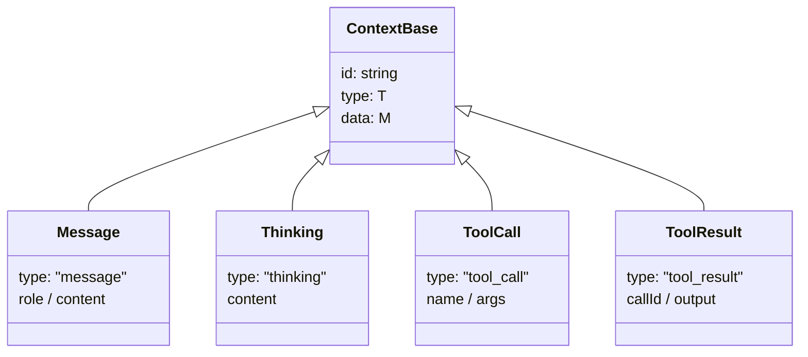
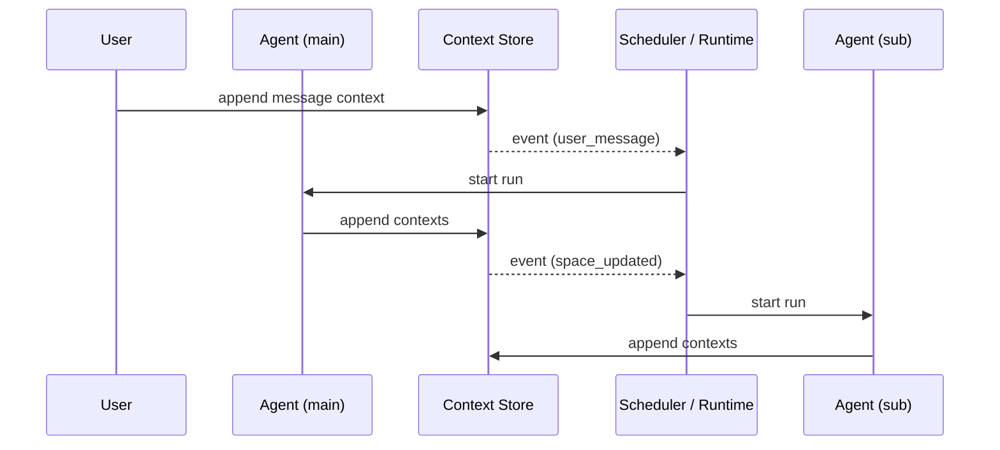

# Texture — Concepts

## Core Principle

Texture では次の 3 つを分けて考える。

- **Context** — durable に残る事実・状態・履歴
- **Event / Trigger** — runtime を起動するための signal
- **Run** — agent が行う 1 回の execution

以前は "Everything is a Context" という整理を考えていたが、multi-agent 協調を考えると `context` と `run` は分けた方が安定する。

## Entities

- **Agent** — 1人格。設定・能力を持つ実行主体
- **Context** — 永続化される source of truth
- **Event / Trigger** — 起動条件
- **Run** — 1 回の agentic loop
- **ContextSpace** — Context が蓄積される場所

## Context

Context は durable な事実・状態・履歴を表す。

例:

- `message`
- `thinking`
- `tool_call`
- `tool_result`
- `task`
- `assignment`
- `agent_status`
- `context_space`

Context は type で区別されるフラットな durable fact として扱う。親子関係や所属関係は Context 自体ではなく、store / persistence レイヤーの relation（`parentId`, `spaceId`, `taskId` など）で表現する。



`ContextSpace` は `Context` とは別の container / scope であり、`Context` union には含めない。

## Run

Run は Agent の 1 回の execution を表す。`Context` ではなく、runtime 側の概念。

- 必ず 1 つの Agent に属する
- lifecycle を持つ（`running` → `completed` / `failed`）
- Event / Trigger によって開始される
- 実行の結果として Context を読む・書く
- 必要なら parent run / child run を持てる

重要なのは、`Run` 自体は durable state の中心ではなく、**Context を処理する execution instance** だということ。

## Agent

Agent は実行主体の定義であり、runtime object そのものではなく、人格・名前・指示を持つ specification として扱う。

```ts
type AgentDefinition = {
  id: string;
  name: string;
  persona: string;
  instructions?: string;
};
```

- `id` は他の構造から参照される安定 ID
- `persona` は長期的な役割や振る舞い方針
- `instructions` は system prompt 相当の補足指示

## ContextSpace

ContextSpace は Context が蓄積される場所。`Context` ではなく、container / shared space の概念。

- `participants` は **AgentDefinition の id** を持つ
- 用途によって使い分ける:
  - **memory** — participants: [自分] / run をまたいで蓄積
  - **communication** — participants: [agent-a, agent-b, ...] / agent 間の共有

## Event / Trigger

Agent は Event / Trigger によって起動する。

例:

- `user_message`
- `space_updated`
- `task_created`
- `dependency_resolved`
- `timer_elapsed`
- `human_reply_received`
- `run_completed`

Event は durable な source of truth ではなく、**起動可能になったことを示す signal**。



## Spawn / Trigger / Run

multi-agent 協調では、次の 3 段階を分ける。

1. **Spawn / Context creation**
   - task, request, context space などの責務単位を作る
2. **Trigger**
   - 何かが変わったので runtime を起動できる状態になる
3. **Run**
   - 実際に agent が execution を行う

つまり、spawn は必ずしも "今すぐ run する" ことではない。

## Coordination Model

single-agent runtime と multi-agent coordination runtime は分けて考える。

### Single-agent runtime

- context を読む
- projection する
- model を回す
- tool を叩く
- output を返す

### Coordination runtime

- context を durable に保持する
- event / trigger を受ける
- scheduler が dispatch を決める
- ownership を管理する
- retry / timeout / resume を扱う

## Persistence

Context は永続化の対象であり、コア型としてはフラットに保つ。

- 保存時: `ContextRecord` に `spaceId` や `createdAt` を持たせて関係を記録する
- 読み出し時: `Scope` を使って必要な records を取得し、space view や tree view を組み立てる
- これらの relation は永続化レイヤーの関心であり、Context のコア型に含めなくてもよい

```
| id    | kind          | parentId | data                         |
|-------|---------------|----------|------------------------------|
| sp-1  | context_space | null     | { participants: ["main"] } |
| msg-1 | message       | sp-1     | { role: "user" }           |
| tc-1  | tool_call     | sp-1     | { name: "search" }         |
| tr-1  | tool_result   | sp-1     | { callId: "call-1" }       |
```

Run は persistence の対象にしてもよいが、その場合でも意味は `Context` の一種というより **execution journal / trace** に近い。

## ContextRecord

`ContextRecord` は、ある `Context` がどの `ContextSpace` にいつ書き込まれたかを表す保存単位。

```ts
type ContextRecord = {
  context: Context;
  spaceId: string;
  createdAt: number;
};
```

現時点では relation は最小限に保ち、まずは `spaceId` による所属だけを扱う。

## Scope

`Scope` は store からどの records を読むかを指定する query model。

```ts
type Scope =
  | { type: "all" }
  | { type: "space"; spaceId: string };
```

まずは `all` と `space` のみを持ち、必要になったら `task`, `since`, `types` などを追加する。

## ContextStore

`ContextStore` は durable な `ContextRecord` を append / query / subscribe するための interface。

```ts
interface ContextStore {
  append(record: ContextRecord): Promise<void>;
  query(scope: Scope): Promise<ContextRecord[]>;
  subscribe(listener: (record: ContextRecord) => void): () => void;
}
```

- `append` は新しい durable fact を保存する
- `query` は `Scope` に応じて records を返す
- `subscribe` は append を観測し、scheduler や trigger の入力に使う

`runner` ではこの interface に対して in-memory 実装を作れる。また `execute()` の `ExecuteEvent` を受けて `context_emitted` を `ContextRecord` に変換し、store に append する薄い orchestration 層を重ねられる。

## Runtime Input Shape

`executeInSpace()` のような orchestration 層は、最低限次を明示的に受け取る。

- 実行可能な runtime agent object
- `agentDefinition`
- `space`
- `store`

ここで `agentDefinition` は人格・指示・ID の source of truth、`space` はどの共有空間を読む / 書くかの source of truth になる。少なくとも現段階では、space の選択は agent 自身ではなく caller / scheduler が行う。

## Design Direction

Texture の設計方針は次の順序を基本とする。

1. **Context が主** — durable な source of truth
2. **Event / Trigger は起動条件**
3. **Run は実行器による 1 回の execution**

この分離により、chat orchestration に閉じず、observable store・scheduler・resume を持つ multi-agent coordination runtime を組み立てやすくする。